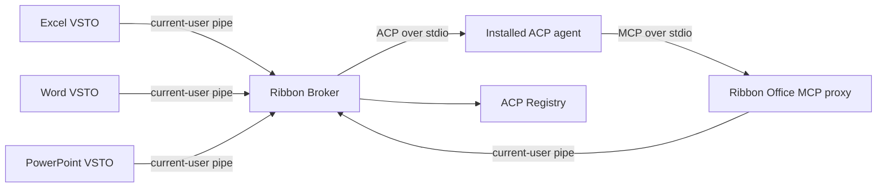

# Ribbon

Ribbon brings installable ACP coding agents into Microsoft Office. Excel, Word, and PowerPoint each use a thin VSTO add-in, while one shared local broker manages the ACP Registry, agent processes, conversations, permissions, and a unified Office MCP server.

The result is one agent experience across Office without forcing Excel to automate the other applications.

## Current vertical slice

- Browse the public ACP Registry from the Office task pane.
- Install Windows binary and `npx` agent distributions. Ribbon provisions a private Node.js LTS runtime when needed and verifies the official Node archive checksum.
- Launch ACP v1 agents, authenticate them, create sessions, stream updates, cancel turns, and answer permission requests.
- Populate an agent-driven model selector from ACP session configuration options and keep it synchronized when the agent changes configuration.
- Give every agent a local stdio MCP server named `ribbon-office`.
- Compose MCP guidance from the tools currently connected to that agent session, with the launching Office host's workflow first.
- Route MCP calls over a current-user named pipe to every connected Office host.
- Use a shared host-branded task pane: **Ribbon Grid for Excel**, **Ribbon Quill for Word**, and **Ribbon Deck for PowerPoint**.
- Reopen a closed task pane from the **Ribbon** group on the Office **Home** tab.
- Match the Windows/Office light or dark appearance with a shared DPI-aware visual system.

Included Office tools:

| Host | Tools |
| --- | --- |
| Excel | context, list sheets, read/write values and formulas, clear/format ranges, add sheets, create tables and charts |
| Word | context, bounded reads, headings, text edits, find/replace, formatting, lists, tables, comments, page breaks |
| PowerPoint | context, structured slide reads, slide lifecycle, text and shapes, formatting, images, tables, charts, notes, backgrounds, find/replace |

### Excel agent tools

The Excel adapter exposes task-oriented tools rather than a thin mirror of the COM object model:

| Tool | Purpose |
| --- | --- |
| `excel_get_context` | Resolve the active workbook, sheet, cell, selection, and used range. |
| `excel_list_sheets` | List worksheet names, visibility, and used ranges. |
| `excel_read_range` | Read bounded values, formulas, and optional number formats. |
| `excel_write_range` | Write a rectangular matrix of values. Formula-like strings remain literal. |
| `excel_write_formulas` | Write a rectangular matrix of explicit A1-style formulas. |
| `excel_clear_range` | Clear contents, formats, or the complete range state. |
| `excel_format_range` | Patch fonts, fills, number formats, alignment, borders, dimensions, and AutoFit. |
| `excel_add_sheet` | Add a validated worksheet at a deliberate workbook position. |
| `excel_create_table` | Turn an existing data range into a named, styled Excel table. |
| `excel_create_chart` | Create and position an embedded chart from an inspected source range. |

Range reads default to 20,000 cells and are hard-limited to 100,000 cells per call. Writes have the same 100,000-cell hard limit. This keeps agent context bounded and encourages targeted inspection.

### Word agent tools

Word operations use document character positions so an agent can inspect structure, make a targeted change, and verify the result:

| Tool | Purpose |
| --- | --- |
| `word_get_context` | Inspect the active document, selection, story, and document statistics. |
| `word_read_document` | Read a bounded slice of the main document story. |
| `word_list_headings` | Discover headings with outline levels and character positions. |
| `word_replace_selection` | Replace the current selection, including deletion with empty text. |
| `word_append_text` | Append text before the document's final paragraph mark. |
| `word_insert_text` | Insert text around the selection or at document boundaries. |
| `word_replace_range` | Replace or delete an exact span using inspected character positions. |
| `word_find_replace` | Perform bounded literal replacement with matching options. |
| `word_format_range` | Patch styles, fonts, paragraph layout, and highlighting. |
| `word_insert_heading` | Insert a paragraph using a built-in Heading 1–9 style. |
| `word_insert_list` | Insert structured bulleted or numbered items. |
| `word_insert_table` | Insert and populate a styled table from a rectangular matrix. |
| `word_add_comment` | Attach a review comment to the selection or explicit positions. |
| `word_insert_page_break` | Insert a page break at a deliberate document position. |

Document reads are limited to 200,000 characters per call. Character positions are snapshots: agents should refresh context or headings after mutations before making another position-based change.

### PowerPoint agent tools

Deck exposes presentation tasks and structured slide state instead of arbitrary COM dispatch:

| Capability | Tools |
| --- | --- |
| Inspect | `powerpoint_get_context`, `powerpoint_list_slides`, `powerpoint_read_slide` |
| Slide lifecycle | `powerpoint_add_slide`, `powerpoint_duplicate_slide`, `powerpoint_move_slide`, `powerpoint_delete_slide` |
| Text and diagrams | `powerpoint_set_slide_title`, `powerpoint_add_textbox`, `powerpoint_add_shape`, `powerpoint_format_shape`, `powerpoint_delete_shape` |
| Data and media | `powerpoint_add_table`, `powerpoint_add_chart`, `powerpoint_add_image` |
| Presentation details | `powerpoint_set_speaker_notes`, `powerpoint_set_slide_background`, `powerpoint_find_replace` |

PowerPoint coordinates and dimensions are measured in points. Use one-based slide numbers from a recent context/list result and target shapes by the returned `shape_name`. Shape formatting is patch-based, so omitted properties are preserved. Local images must already exist at an absolute path; Deck does not perform downloads inside PowerPoint.

## Architecture



The add-ins contain only UI and application-specific COM operations. The .NET 10 broker owns everything process-oriented, including agent installation and ACP/MCP transport. See [docs/architecture.md](docs/architecture.md) for protocol and security details.

## Build

Requirements:

- Windows with desktop Excel, Word, and PowerPoint
- Visual Studio with **Office/SharePoint development** tools
- .NET Framework 4.8 targeting pack
- .NET 10 runtime for the broker

Build the complete solution from a Visual Studio developer shell:

```powershell
msbuild Ribbon.slnx /t:Build /p:Configuration=Debug /m
```

The VSTO builds include `Ribbon.Broker.exe` and its runtime files in each deployment manifest. During repository development the shared client can also locate the broker under `Ribbon.Broker/bin`; `RIBBON_BROKER_PATH` overrides this lookup.

To try Ribbon, set `Grid`, `Quill`, or `Deck` as the startup project and press **F5**. In the corresponding host-branded Ribbon task pane:

1. Select **Agents**.
2. Install a compatible agent such as OpenCode or Codex.
3. Select it from the agent list and enter a prompt. Use **Ctrl+Enter** to send.

Agent state is stored under `%LOCALAPPDATA%\Ribbon`:

- `agents` — downloaded binary agents
- `runtimes` — Ribbon-managed runtimes such as Node.js
- `sessions` — isolated ACP working directories and Office guidance
- `cache` — cached ACP Registry document
- `logs` — broker diagnostics

## Project layout

- `Ribbon.Contracts` — versioned broker wire contracts shared by .NET Framework and .NET 10
- `Ribbon.Broker` — ACP client, registry installer, session manager, Office MCP proxy, and host router
- `Ribbon.Vsto` — reusable named-pipe client, agent manager, permission UI, and task pane
- `Grid` — Excel host adapter
- `Quill` — Word host adapter
- `Deck` — PowerPoint host adapter

## Scope and next work

This is a working architectural slice, not yet a production installer. The next useful increments are tracked-changes and image/section support for Word, conditional formatting and sorting for Excel, a selectable authentication-method dialog, signed release packaging with a .NET runtime prerequisite or self-contained broker, reconnect/session recovery, and automated integration tests with a fake ACP agent.
