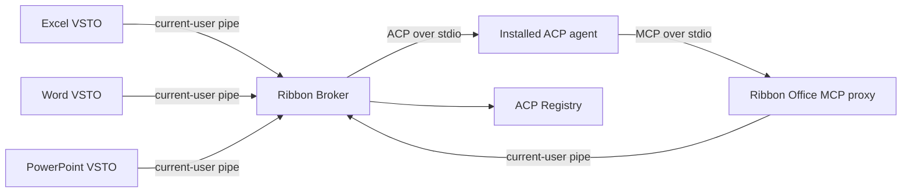

# Ribbon

Ribbon brings installable ACP coding agents into Microsoft Office. Excel, Word, and PowerPoint each use a thin VSTO add-in, while one shared local broker manages the ACP Registry, agent processes, conversations, permissions, and a unified Office MCP server.

The result is one agent experience across Office without forcing Excel to automate the other applications.

## Current vertical slice

- Browse the public ACP Registry from the Office task pane.
- Install Windows binary and `npx` agent distributions. Ribbon provisions a private Node.js LTS runtime when needed and verifies the official Node archive checksum.
- Launch ACP v1 agents, authenticate them, create sessions, stream updates, cancel turns, and answer permission requests.
- Give every agent a local stdio MCP server named `ribbon-office`.
- Route MCP calls over a current-user named pipe to every connected Office host.
- Use the same **Ribbon Agents** task pane in Excel, Word, and PowerPoint.
- Match the Windows/Office light or dark appearance with a shared DPI-aware visual system.

Included Office tools:

| Host | Tools |
| --- | --- |
| Excel | context, list sheets, read range, write range |
| Word | context, read document, replace selection, append text |
| PowerPoint | context, list slides, read slide, add slide |

## Architecture



The add-ins contain only UI and application-specific COM operations. The .NET 10 broker owns everything process-oriented, including agent installation and ACP/MCP transport. See [docs/architecture.md](docs/architecture.md) for protocol and security details.

## Build

Requirements:

- Windows with desktop Excel, Word, and PowerPoint
- Visual Studio with **Office/SharePoint development** tools
- .NET Framework 4.8 targeting pack
- .NET 10 runtime for the broker

Build the complete solution from a Visual Studio developer shell:

```powershell
msbuild Ribbon.slnx /t:Build /p:Configuration=Debug /m
```

The VSTO builds include `Ribbon.Broker.exe` and its runtime files in each deployment manifest. During repository development the shared client can also locate the broker under `Ribbon.Broker/bin`; `RIBBON_BROKER_PATH` overrides this lookup.

To try Ribbon, set `Grid`, `Quill`, or `Deck` as the startup project and press **F5**. In the **Ribbon Agents** pane:

1. Select **Agents…**.
2. Install a compatible agent such as OpenCode or Codex.
3. Select it from the agent list and enter a prompt. Use **Ctrl+Enter** to send.

Agent state is stored under `%LOCALAPPDATA%\Ribbon`:

- `agents` — downloaded binary agents
- `runtimes` — Ribbon-managed runtimes such as Node.js
- `sessions` — isolated ACP working directories and Office guidance
- `cache` — cached ACP Registry document
- `logs` — broker diagnostics

## Project layout

- `Ribbon.Contracts` — versioned broker wire contracts shared by .NET Framework and .NET 10
- `Ribbon.Broker` — ACP client, registry installer, session manager, Office MCP proxy, and host router
- `Ribbon.Vsto` — reusable named-pipe client, agent manager, permission UI, and task pane
- `Grid` — Excel host adapter
- `Quill` — Word host adapter
- `Deck` — PowerPoint host adapter

## Scope and next work

This is a working architectural slice, not yet a production installer. The next useful increments are richer Office tool catalogs, a selectable authentication-method dialog, signed release packaging with a .NET runtime prerequisite or self-contained broker, reconnect/session recovery, and automated integration tests with a fake ACP agent.

The old Grid chat/MCP implementation remains in the source tree for reference but is no longer compiled or referenced by the add-in.
